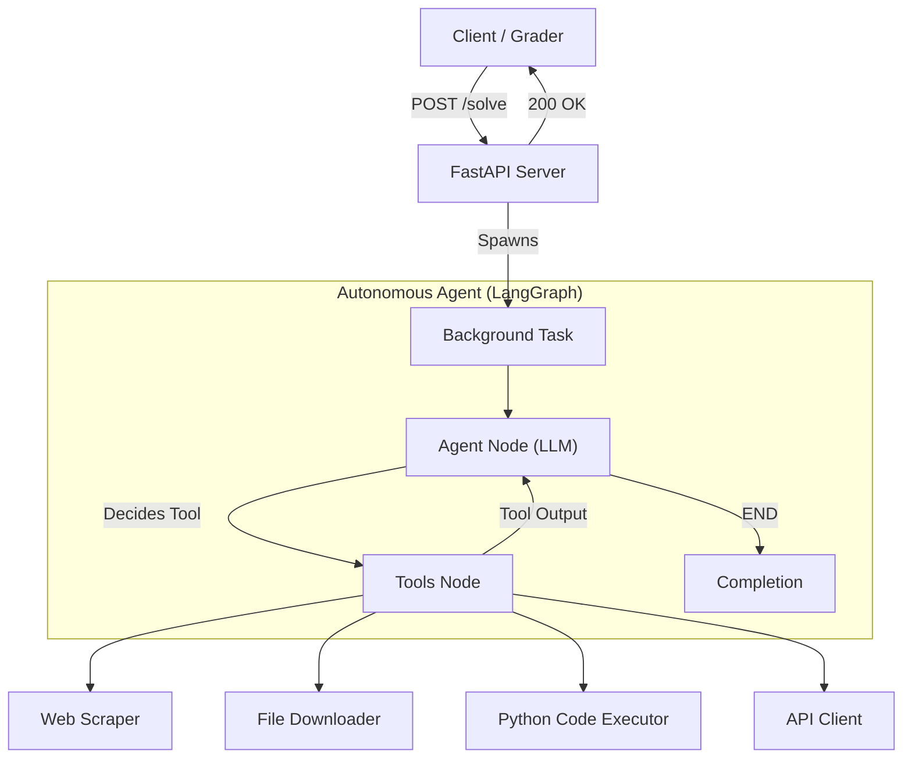

# LLM Analysis - Autonomous Quiz Solver Agent

[](https://opensource.org/licenses/MIT)
[](https://www.python.org/downloads/)
[](https://fastapi.tiangolo.com/)
[](https://deepmind.google/technologies/gemini/)

An intelligent, autonomous agent built with **LangGraph** and **Google Gemini 2.5 Flash** that solves complex data-related quizzes. This system is designed to autonomously navigate web pages, scrape data, perform analysis, and submit answers via API, all while handling errors and optimizing for rate limits.

## 📋 Table of Contents

- [Project Statement](#-project-statement)
- [Architecture](#-architecture)
- [Features](#-features)
- [Project Structure](#-project-structure)
- [Installation](#-installation)
- [Configuration](#-configuration)
- [Usage](#-usage)
- [API Endpoints](#-api-endpoints)
- [Tools & Capabilities](#-tools--capabilities)
- [Design Choices (Viva Prep)](#-design-choices-viva-prep)
- [License](#-license)

## 🔍 Project Statement

This project fulfills the requirements for the **Tools in Data Science (TDS)** course project. The objective is to build an application that can:

1.  **Receive a Task**: Accept a POST request with a quiz URL, email, and secret.
2.  **Verify Identity**: Authenticate the request using a pre-shared secret.
3.  **Solve Quizzes**: Visit the URL, understand the task (which may involve data sourcing, preparation, analysis, or visualization), and solve it.
4.  **Submit Answers**: POST the correct answer to a submission endpoint within a strict time limit (3 minutes per task).
5.  **Iterate**: Handle multi-step quizzes where a correct answer leads to a new URL.

The system is robust against malformed inputs, handles strict timeouts, and uses a cost-effective yet powerful LLM (Gemini 2.5 Flash).

## 🏗️ Architecture

The project uses a **LangGraph state machine** architecture to orchestrate the agent's actions. This allows for cyclic execution (Agent -> Tool -> Agent) which is essential for multi-step reasoning.



### Key Components:

1.  **FastAPI Server** (`main.py`): Entry point. Validates secrets and spawns the agent as a background task to prevent HTTP timeouts.
2.  **LangGraph Agent** (`agent.py`): The brain. Maintains state (chat history) and decides which tool to call next.
3.  **Tools Package** (`tools/`): A suite of specialized tools for the agent to interact with the world.
4.  **LLM**: Google Gemini 2.5 Flash, chosen for its speed, low cost, and large context window (1M tokens).

## ✨ Features

-   **Autonomous Navigation**: Follows quiz chains from one URL to the next.
-   **Dynamic Scraping**: Uses **Playwright** to render and scrape JavaScript-heavy websites.
-   **Sandboxed Code Execution**: Writes and runs Python code to solve complex data analysis and math problems.
-   **File Handling**: Downloads and processes various file formats (PDF, CSV, Images).
-   **OCR & Vision**: Uses Gemini's multimodal capabilities to read text from images and screenshots.
-   **Audio Transcription**: Transcribes audio files when necessary.
-   **Self-Correction**: Detects malformed JSON or failed tool calls and instructs the LLM to retry.
-   **Time Management**: Monitors task duration and forces a "best guess" submission if the 3-minute limit approaches.

## 📁 Project Structure

```
LLM-Analysis-TDS-Project-2/
├── agent.py                    # Core logic: LangGraph setup, System Prompt, State management
├── main.py                     # API Server: /solve endpoint, background task dispatch
├── tools/                      # Tool definitions
│   ├── __init__.py             # Exports tools list
│   ├── web_scraper.py          # Playwright integration
│   ├── run_code.py             # Python subprocess executor
│   ├── send_request.py         # API submission tool
│   ├── download_file.py        # File downloader
│   ├── add_dependencies.py     # Dynamic pip/uv installer
│   ├── image_content_extracter.py # OCR tool
│   ├── audio_transcribing.py   # Audio tool
│   └── encode_image_to_base64.py # Image utility
├── Dockerfile                  # Deployment configuration
├── pyproject.toml              # Dependencies (uv/pip)
└── README.md                   # Documentation
```

## 📦 Installation

### Prerequisites

-   Python 3.12+
-   [uv](https://github.com/astral-sh/uv) (Recommended) or pip
-   Git

### 1. Clone the Repository

```bash
git clone https://github.com/saivijayragav/LLM-Analysis-TDS-Project-2.git
cd LLM-Analysis-TDS-Project-2
```

### 2. Install Dependencies

**Using `uv` (Fastest):**

```bash
pip install uv
uv sync
uv run playwright install chromium
```

**Using `pip`:**

```bash
python -m venv venv
# Windows
.\venv\Scripts\activate
# Linux/Mac
source venv/bin/activate

pip install -e .
playwright install chromium
```

## ⚙️ Configuration

Create a `.env` file in the root directory. This file is **crucial** for authentication and API access.

```env
# Google Form Credentials (used to verify incoming requests)
EMAIL=your.email@example.com
SECRET=your_secret_string

# LLM Provider
GOOGLE_API_KEY=your_gemini_api_key
```

> **Note**: You can get a Gemini API key from [Google AI Studio](https://aistudio.google.com/).

## 🚀 Usage

### Start the Server

```bash
# Using uv
uv run main.py

# Using python
python main.py
```

The server will start at `http://0.0.0.0:7860`.

### Test the Endpoint

You can test the agent using `curl` or any API client (Postman, Insomnia).

```bash
curl -X POST http://localhost:7860/solve \
  -H "Content-Type: application/json" \
  -d '{
    "email": "your.email@example.com",
    "secret": "your_secret_string",
    "url": "https://tds-llm-analysis.s-anand.net/demo"
  }'
```

**Expected Response:**
```json
{"status": "ok"}
```

Check your server logs to watch the agent solve the demo quiz in real-time!

## 🌐 API Endpoints

### `POST /solve`

Triggers the autonomous agent.

**Payload:**
```json
{
  "email": "student@example.com",
  "secret": "xyz123",
  "url": "https://example.com/quiz-start"
}
```

| Status | Description |
| :--- | :--- |
| `200` | Success. Agent started in background. |
| `400` | Bad Request (Missing fields or invalid JSON). |
| `403` | Forbidden (Secret does not match `.env`). |

### `GET /healthz`

Returns server status and uptime.

## 🛠️ Tools & Capabilities

The agent is equipped with the following tools:

1.  **`get_rendered_html`**: Fetches the DOM of a page *after* JavaScript execution. Essential for Single Page Applications (SPAs).
2.  **`run_code`**: Executes Python code. Used for math, dataframes (pandas), and string manipulation.
3.  **`download_file`**: Downloads resources to a local `LLMFiles/` directory.
4.  **`ocr_image_tool`**: Extracts text from images using Gemini Vision.
5.  **`transcribe_audio`**: Converts audio files to text.
6.  **`post_request`**: Submits the final answer to the quiz endpoint.
7.  **`add_dependencies`**: Installs missing Python packages on the fly (e.g., `scikit-learn`, `beautifulsoup4`).

## 🧠 Design Choices (Viva Prep)

### Why LangGraph?
We chose **LangGraph** over a simple loop or linear chain because it provides a structured **State Machine**. This allows the agent to:
-   **Loop**: Retry failed steps or process multiple pages.
-   **Branch**: Decide between using a tool or answering directly.
-   **Persist State**: Keep track of the entire conversation history (messages, tool outputs) to make informed decisions.

### Why Gemini 2.5 Flash?
-   **Cost/Performance**: It is significantly cheaper than GPT-4 while offering comparable reasoning for these types of tasks.
-   **Speed**: "Flash" models are optimized for low latency, which is critical for the 3-minute timeout.
-   **Context Window**: The 1M token window allows us to feed entire HTML pages or large code outputs without truncation.

### Why Background Tasks?
The `/solve` endpoint returns `200 OK` immediately and runs the agent in a **Background Task**.
-   **Reason**: The quiz solving process can take 1-3 minutes. Keeping the HTTP connection open that long would likely cause a timeout on the client side (the grader). Background tasks decouple the request acknowledgment from the execution.

### Prompt Engineering Strategy
Our system prompt is designed to be **defensive** and **instruction-following**:
-   It explicitly forbids hallucinating URLs.
-   It enforces the use of tools for base64 encoding to prevent long text output.
-   It includes a "Time Check" mechanism to force a guess if the deadline is near.

## 📄 License

This project is licensed under the MIT License.
